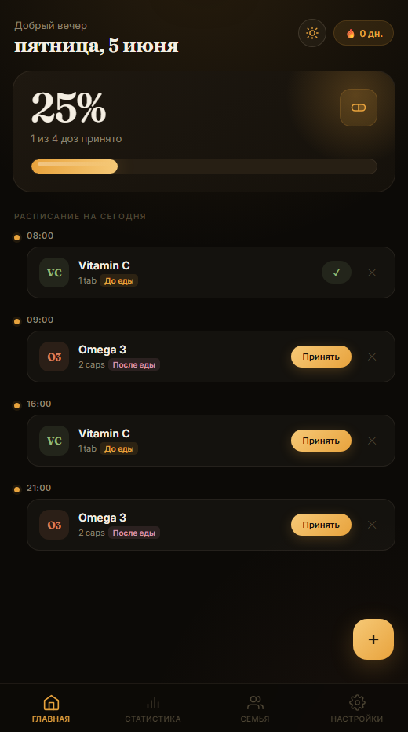
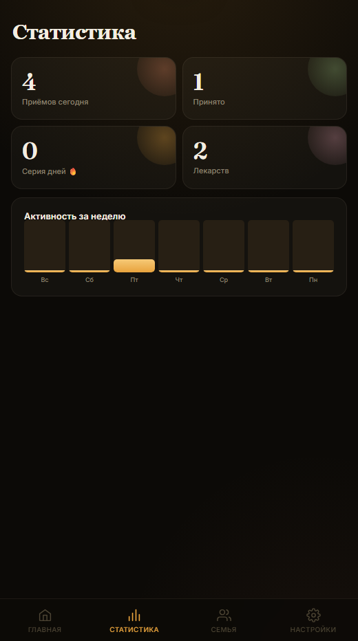
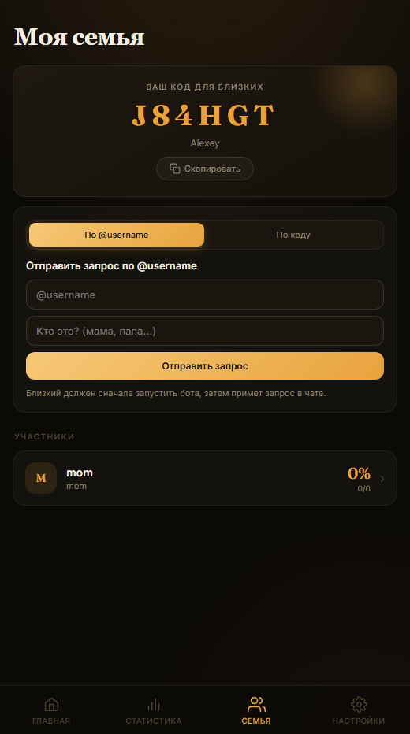

# Pillio

Pillio - это трекер приёма лекарств. Внутри у него C++ backend, Telegram Mini App и Telegram-бот.  
Backend хранит лекарства и расписание в JSON-файлах, строит слоты приёма, считает прогресс и streak, а ещё отвечает за семейный доступ и уведомления.

## Зачем он нужен

Проект помогает:

- вести список лекарств;
- автоматически строить расписание приёма;
- отмечать, что лекарство уже принято;
- смотреть текущий прогресс и streak;
- делиться статусом приёма с близкими;
- отправлять и принимать семейные запросы по `@username`;
- получать напоминания через Telegram-бота;
- запускать тесты и генерировать документацию в формате, который требует учебный проект.

## Как он устроен

У проекта несколько основных частей:

- `src/models.hpp` - доменные модели `Pill` и `Schedule`, а также типы исключений;
- `src/tracker.cpp` - время, слоты приёма и расчёт следующего приёма;
- `src/storage.cpp` - JSON-хранилище лекарств и расписаний;
- `src/family.cpp` - семейный доступ, профили, запросы и связи;
- `src/main.cpp` - HTTP-сервер и REST API;
- `static/index.html` - интерфейс Telegram Mini App;
- `bot/` - Telegram-бот и фоновые уведомления;
- `tests/tests.cpp` - doctest-тесты для основной логики;
- `docs/` - сгенерированная Doxygen-документация.

Идея простая: фронтенд и бот не лезут в файлы напрямую, а ходят в backend по HTTP. Так логика остаётся в одном месте, а интерфейс только показывает данные.

## Что умеет приложение

- добавлять и удалять лекарства;
- строить расписание на день;
- отмечать отдельный приём как выполненный;
- показывать следующий приём;
- показывать сегодняшнюю статистику и streak;
- создавать профиль семьи и делиться кодом;
- отправлять запросы на добавление по `@username`;
- принимать и отклонять семейные запросы;
- отправлять напоминания через Telegram-бота;
- запускать тесты и собирать HTML-документацию.

## Сборка

Требования:

- CMake 3.19+;
- компилятор с поддержкой C++20.

Обычная сборка:

```bash
cmake -S . -B build
cmake --build build
ctest --test-dir build --output-on-failure
```

Если используешь preset:

```bash
cmake --preset debug
cmake --build --preset debug
ctest --test-dir build/debug --output-on-failure
```

## Запуск

После сборки основной исполняемый файл можно запустить так:

```powershell
.\build\verify\pillio.exe
```

или, если собран `debug` preset:

```powershell
.\build\debug\pillio.exe
```

По умолчанию сервер слушает `http://localhost:8080`.

## Переменные окружения

Проект позволяет менять пути без правки исходников:

- `STORAGE_PATH` - путь к JSON-файлу лекарств и расписаний;
- `FAMILY_STORAGE_PATH` - путь к JSON-файлу семейного доступа;
- `STATIC_DIR` - папка со статикой;
- `API_PORT` - порт HTTP-сервера;
- `BOT_TOKEN` - токен Telegram-бота;
- `WEBAPP_URL` - URL Mini App;
- `API_URL` - URL backend API.

Пример запуска:

```powershell
$env:STORAGE_PATH = "./data/store.json"
$env:FAMILY_STORAGE_PATH = "./data/family.json"
$env:API_PORT = "8080"
.\build\verify\pillio.exe
```

## Как пользоваться

### Добавить лекарство

В Mini App задаются название, дозировка, интервал и время первого приёма.  
Backend сохраняет лекарство и сразу строит расписание.

### Отметить приём

Открываешь расписание на день и отмечаешь, что лекарство принято.  
После этого backend обновляет соответствующий слот и пересчитывает статистику.

### Посмотреть streak

На главном экране Mini App показывается серия дней без пропусков.  
Это значение приходит с backend через `/api/stats`.

### Поделиться статусом с близкими

Можно создать семейный профиль, получить share-код или отправить запрос по `@username`.  
После принятия запроса близкий человек видит статус приёмов.

### Получить напоминание

Telegram-бот регулярно проверяет backend, находит просроченные приёмы и присылает уведомление.

## API вкратце

- `GET /api/pills` - список лекарств;
- `POST /api/pills` - добавить лекарство;
- `DELETE /api/pills/:id` - удалить лекарство;
- `GET /api/schedule?date=YYYY-MM-DD` - расписание на день;
- `POST /api/take` - отметить приём;
- `GET /api/next?pill_id=N` - следующий приём;
- `GET /api/stats` - прогресс и streak;
- `GET /api/family/me` - профиль семьи;
- `POST /api/family/request` - запрос на добавление по `@username`;
- `GET /api/family/requests` - входящие запросы;
- `POST /api/family/request/accept` - принять запрос;
- `POST /api/family/request/decline` - отклонить запрос.

## Тесты

Тесты написаны на doctest и запускаются через CTest:

```bash
ctest --test-dir build --output-on-failure
```

Они покрывают:

- валидацию моделей;
- JSON round-trip;
- генерацию слотов;
- расчёт следующего приёма;
- дневной прогресс;
- CRUD хранилища;
- семейные сценарии.

## Документация

Документация оформлена в Doxygen-формате в заголовочных файлах и собирается в HTML:

```bash
doxygen Doxyfile
```

Результат лежит в `docs/html/index.html`.

## Скриншоты

Ниже показаны основные экраны Mini App в мобильной верстке.

### Главный экран



### Статистика



### Семейный доступ



## Telegram-бот

Бот лежит в `bot/` и использует:

- `BOT_TOKEN` - токен Telegram-бота;
- `WEBAPP_URL` - ссылку на Mini App;
- `API_URL` - адрес C++ backend.

Бот присылает напоминания, показывает сводки по приёмам и обрабатывает семейные запросы.
